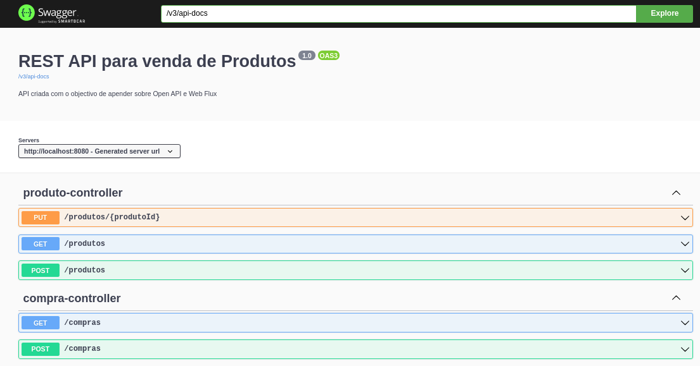

# Spring Boot WebFlux

Projecto desenvolvido com o objectivo de aprofundar na aplicação de Open-Api numa **Rest API**.

---

## _RESULTADO_

## 

## Execução

---

Para executar a aplicação é necessário ter o **Docker** instalado, **Docker-Compose** e o **JDK 11**.

Cumpindo os requisitos

1º Abra o terminal e digite o a linha abixo

```shell script
git clone https://github.com/fmanuel98/spring-hateaos-webflux.git
```

2º Digite o comando asseguir

```shell script
cd spring-hateaos-webflux
```

3º O ultimo passo digite o comando a seguir

```shell script
docker-compose up -d && ./mvnw spring-boot:run
```

4º e Ultimo agora abra o seu navegador e digite

```
http://localhost:8080/swagger-ui.html
```
